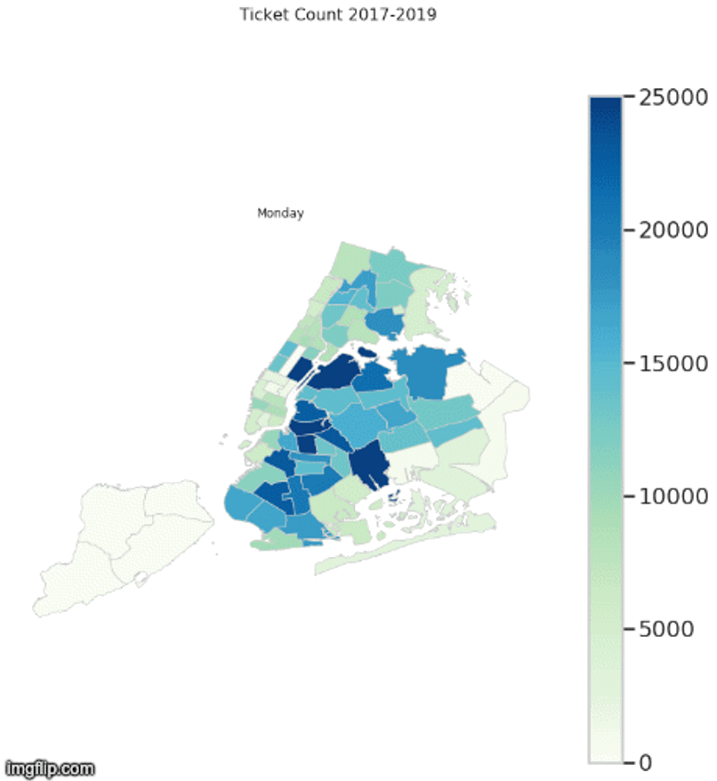
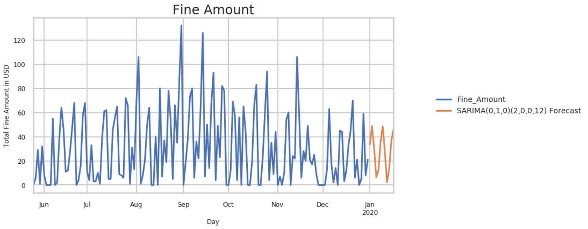

# Avoid Parking Tickets in NYC
Meagan Rossi

## Overview 
Predicts days, seasons and weather patterns that more likely result in tickets with a focus on alternate side parking violations.
Obtained over 7M individual tickets from NYC Open Data API for analysis using Python to upload, clean, and reshape data.
Merged precinct geospatial data and NOAA weather data into the Pandas Dataframe to evaluate impact of exogenous variables.
Used SARIMA Machine Learning to predict daily ticket issuance by precinct.

was the size of the dataset used in the project?
Did you collect data using API calls and web-scraping?
Did you clean/manipulate data with Python for analysis?
Did you train a wide range of shallow- and deep-learning models? Which ones?
Did you build a web dashboard, using Dash and Flask, to display data visualizations and patterns?
What unique/impressive features or functionalities of the project do these technologies enable?
Highlighting technology details like above applies to both solo and group projects. If you collaborated with others, make sure you have a clear understanding of all components of the project, including the features your partners built, what technologies they chose, and why. You’ll need to know this when it comes time to interview.
Structure
Here is an example of a (data science) project that does the same:
Conducted natural language (NLP) processing with NLTK to tokenize and vectorize 25,000 articles from news outlets
Extracted various sentiment metrics using TextBlob and Vader to refine machine learning algorithm and identify trends
Employed Naïve Bayes Classifier and Logistic Regression to model probability of article reliability

## Tools 
SARIMA

**Data Sources:**
1. NYC Open Data: [Open Parking and Camera Violations](https://data.cityofnewyork.us/City-Government/Open-Parking-and-Camera-Violations/nc67-uf89)
2. NYC Open Data: [Police Precincts](https://data.cityofnewyork.us/Public-Safety/Police-Precincts/78dh-3ptz)
3. NOAA [National Centers for Environmental Information](https://www.ncdc.noaa.gov/cdo-web/search)

Thank you!
Please reach out to me, meaganrossi@gmail.com for any questions.
